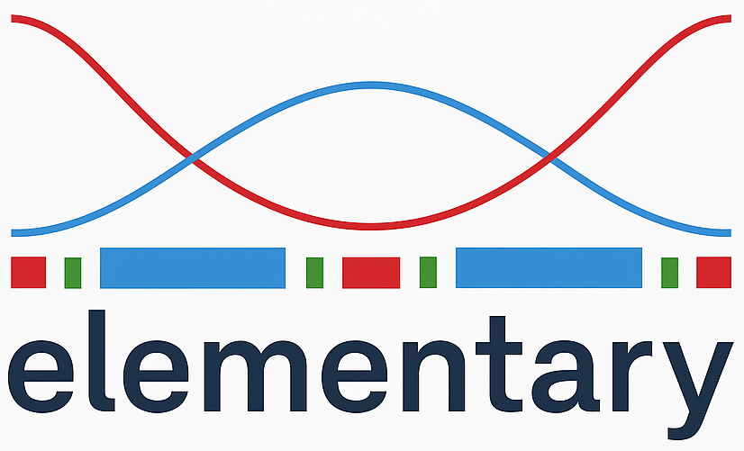

# elementary, 2025

<p align="center">
  
</p>

Generic differentiable accelerator elements modeling in JAX

[](https://doi.org/10.5281/zenodo.15771384)

# Install

```
$ pip install git+https://github.com/i-a-morozov/elementary.git@main
```
